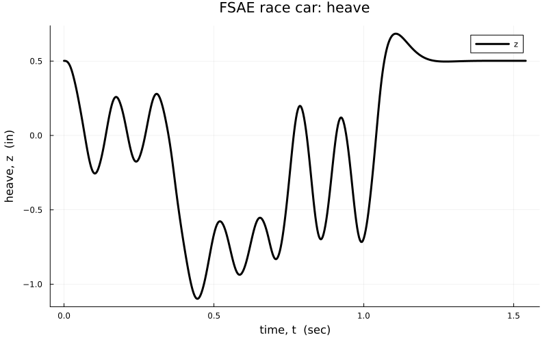
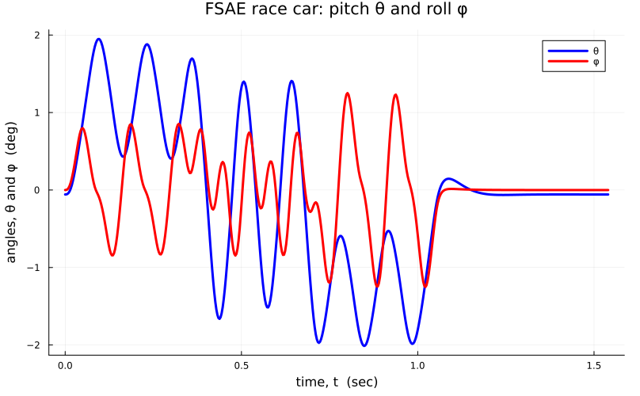
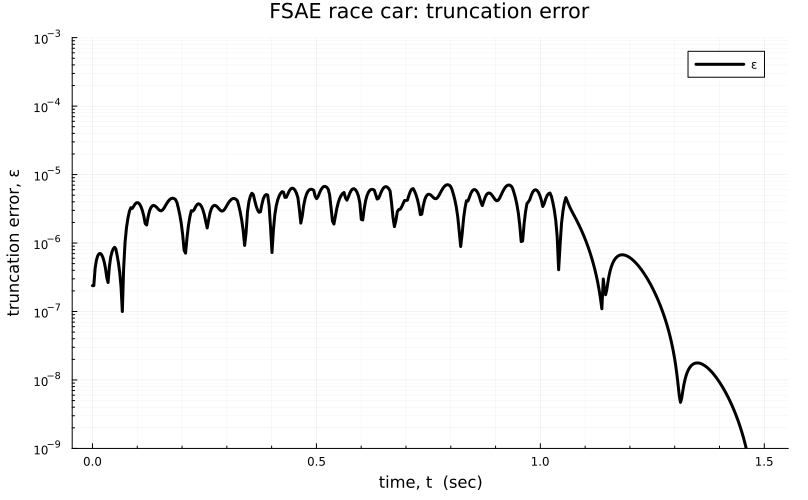

To view this file, use a markdown viewer that renders LaTeX commands, e.g., Remarkable.

# Ordinary Differential Equations (ODEs)

Software has been written in the julia programming language. To use this module, you will need to add the following repositories to your project:

```julia
using Pkg
Pkg.add(url = "https://github.com/AlanFreed/PhysicalFields.jl")
Pkg.add(url = "https://github.com/AlanFreed/TwoStepPECE.jl")
```

This package provides numerical methods for solving systems of first- and second-order ODEs, paired as a system of controls and responses. The control function is taken to be described by a first-order ODE, while the response function can be described by either a first- or second-order ODE. 

The predict/evaluate/correct/evaluate (PECE) methods of Freed (2017) have been implemented. Because these methods are two-step integrators, they are not self starting, so one-step methods are required to take the first integration step.

Notation  $\mathbf{y}^{\prime}$  denotes  $\mathrm{d}\mathbf{y}/\mathrm{d}t$, while notation  $\mathbf{y}^{\prime\prime}$  denotes  $\mathrm{d}²\mathbf{y}/\mathrm{d}t²$.


### First-Order ODEs

For a first-order ODE, one solves the pair
$$
\begin{aligned}
\mathbf{x}^{\prime} & = \boldsymbol{f}_x(model, t, \mathbf{x}, \mathbf{y}) & & \text{control} \\
\mathbf{y}^{\prime} & = \boldsymbol{f}_y(model, t,  \mathbf{x}, \mathbf{y}) & & \text{response}
\end{aligned}
$$
where $model$ is a data structure that passes a set of model constants for the ODE being solved,  while scalar $t$ is the independent variable, usually denoting time. Vector $\mathbf{x}$ is comprised of control variables, while vector $\mathbf{y}$ is comprised of response variables.

Such a paired set of ODEs is subject to initial conditions  of $\mathbf{x}₀$ and $\mathbf{y}₀$  so that
$$
\begin{aligned}
\mathbf{x}^{\prime}_0 & = \boldsymbol{f}_x(model, t_0, \mathbf{x}_0, \mathbf{y}_0) \\
\mathbf{y}^{\prime}_0 & = \boldsymbol{f}_y(model, t_0,  \mathbf{x}_0, \mathbf{y}_0) 
\end{aligned}
$$
when evaluated at time $t_0$.

 It is possible for the control and response functions to be coupled; hence, an implicit solver is needed. It is also possible that only a response function exists, in which case the control function $\boldsymbol{f}_x$ is to return a vector of zero length, i.e.,  `Vector{Float64}(undef, 0).`
 
The data structure `model` is to be a concrete implementation of the abstract type
```julia
abstract type Model end
```
exported by module `TwoStepPECE.`

### Second-Order ODEs

For a second-order ODE, one solves the pair
$$
\begin{aligned}
\mathbf{x}^{\prime} & = \boldsymbol{f}_x ( model, t, \mathbf{x} , \mathbf{y} )  & & \text{control} \\
\mathbf{y}^{\prime\prime} & = \boldsymbol{f}_y ( model, t, \mathbf{x} , \mathbf{y} , \mathbf{y}^{\prime} ) & & \text{response}
\end{aligned}
$$
where $model$ is a data structure that passes a set of model constants for the ODE being solved,  while scalar $t$ is the independent variable, usually denoting time. Vector $\mathbf{x}$ comprises the control variables, while vectors $\mathbf{y}$ and $\mathbf{y}^{\prime}$ comprise the response variables and their respective rates.

Such a paired set of ODEs is subject to initial conditions of $\mathbf{x}_0$, $\mathbf{y}_0$ and $\mathbf{y}^{\prime}_0$  so that
$$
\begin{aligned}
\mathbf{x}^{\prime}_0 & = \boldsymbol{f}_x(model, t_0, \mathbf{x}_0, \mathbf{y}_0) \\
\mathbf{y}^{\prime\prime}_0 & = \boldsymbol{f}_y(model, t_0, \mathbf{x}_0, \mathbf{y}_0 ,  \mathbf{y}^{\prime}_0) 
\end{aligned}
$$
when evaluated at time $t_0$.

 It is possible for the control and response functions to be coupled; hence, an implicit solver is needed. It is also possible that only a response function exists, in which case the control function $\boldsymbol{f}_x$ is to return a vector of zero length, i.e.,  `Vector{Float64}(undef, 0).`
 
The data structure `model` is to be a concrete implementation of the abstract type
```julia
abstract type Model end
```
exported by module `TwoStepPECE.`

# Numerical Methodology

A local solution advances along a sub-grid with a local step size  $h$  that is finer than the global step size  $\mathrm{d}t$  in which  $h$  embeds.  This solution spans an interval  $[t_0, t_N]$  with
$$
\mathrm{d}t = (t_N - t_0) / N
$$ 
and, as such, there will be  $N$  nodes of integration where solutions are sought. Solution arrays are of length $N+1$, whose first entry associates with an initial condition. The global step $\mathrm{d}t$  is taken to be uniform over the entire span of integration, while the local step  $h$  dynamically adjusts itself to ensure truncation error remains less than an user specified error tolerance denoted as  $tol$.  Global node counters *increment* as $n = 0, 1, 2, ⋯, N$, while local node counters *decrement* as $s = S, S-1, S-2, ⋯, 0$, where  $s=S$ and $s=0$  associate with two, neighboring, global nodes, say $n$ and $n+1$.

Of the two differential equations, one for control and the other for response, the one governing control is often better behaved than the one governing response. Nevertheless, at any given location along a solution path, either solution may produce the greater truncation error.  Hence, from the perspective of time-step control, the errors produced by both ODE solvers need to be monitored and managed.

## Determining an Initial Step Size

To provide an estimate for the initial step size  $h$  to be used when taking the first integration step, we employ an algorithm from Freed & Iskovitz (1996). From the initial condition, assign
$$
    h_0 = \| \mathbf{y}_0 \| / \| \mathbf{y}^{\prime}_0 \|
$$
where, e.g.,  $\| \mathbf{y} \|$  is a norm for  $\mathbf{y}$.  To help avoid a wind-down or a wind-up instability, this interval is constrained so that
$$
\mathrm{d}t/100 \lt h_0 \lt \mathrm{d}t/10 .
$$

For a first-order ODE, proceed by integrating
$$
\begin{aligned}
    t_1  & = t_0 + h_0 & & \\
    \mathbf{x}_1 & = \mathbf{x}_0 + h_0 \mathbf{x}^{\prime}_0 & & \\
    \mathbf{y}_1 & = \mathbf{y}_0 + h_0 \mathbf{y}^{\prime}_0  & & \text{P} \\
    \mathbf{x}^{\prime}_1 & = \boldsymbol{f}_x(model, t_1, \mathbf{x}_1, \mathbf{y}_1)  & & \\
    \mathbf{y}^{\prime}_1 & = \boldsymbol{f}_y(model, t_1, \mathbf{x}_1, \mathbf{y}_1)  & & \text{E} \\
    \mathbf{x}_1& ← \mathbf{x}_0 + (h_0/2)( \mathbf{x}^{\prime}_1 + \mathbf{x}^{\prime}_0 ) \ & & \\
    \mathbf{y}_1& ← \mathbf{y}_0 + (h_0/2)( \mathbf{y}^{\prime}_1 + \mathbf{y}^{\prime}_0 )  & & \text{C} \\
    \mathbf{x}^{\prime}_1& ← \boldsymbol{f}_x(model, t_1, \mathbf{x}_1, \mathbf{y}_1)  & & \\
    \mathbf{y}^{\prime}_1& ← \boldsymbol{f}_y(model, t_1, \mathbf{x}_1, \mathbf{y}_1)  & & \text{E}
\end{aligned}
$$
which is the predict/evaluate/correct/evaluate (PECE) method of Heun. 

For a second-order ODE, proceed by integrating
$$
\begin{aligned}
    t_1  & = t_0 + h_0 & & \\
    \mathbf{x}_1 & = \mathbf{x}_0 + h_0 \mathbf{x}^{\prime}_0 & & \\
    \mathbf{y}_1 & = \mathbf{y}_0 + h_0 \mathbf{y}^{\prime}_0  + (h^2_0 / 2) \mathbf{y}^{\prime\prime}_0 & &\\
    \mathbf{y}^{\prime}_1 & = \mathbf{y}^{\prime}_0 + h_0 \mathbf{y}^{\prime\prime}_0  & & \text{P} \\
    \mathbf{x}^{\prime}_1 & = \boldsymbol{f}_x(model, t_1, \mathbf{x}_1, \mathbf{y}_1)  & &\\
    \mathbf{y}^{\prime\prime}_1 & = \boldsymbol{f}_y(model,  t_1, \mathbf{x}_1, \mathbf{y}_1,  \mathbf{y}^{\prime}_1)  & & \text{E}  \\
    \mathbf{x}_1& ← \mathbf{x}_0 + (h_0/2)( \mathbf{x}^{\prime}_1 + \mathbf{x}^{\prime}_0 )  & & \\
    \mathbf{y}_1 &  ← \mathbf{y}_0 + (h_0/2)( \mathbf{y}^{\prime}_1 + \mathbf{y}^{\prime}_0 ) - (h_0^2 / 12) ( \mathbf{y}^{\prime\prime}_1 - \mathbf{y}^{\prime\prime}_0 ) & & \\
    \mathbf{y}^{\prime}_1 & ← \mathbf{y}^{\prime}_0 + (h_0 / 2)( \mathbf{y}^{\prime\prime}_1 + \mathbf{y}^{\prime\prime}_0 )  & &  \text{C} \\
    \mathbf{x}^{\prime}_1 & = \boldsymbol{f}_x(model, t_1, \mathbf{x}_1, \mathbf{y}_1)  & & \\
    \mathbf{y}^{\prime\prime}_1 & = \boldsymbol{f}_y(model,  t_1, \mathbf{x}_1, \mathbf{y}_1, \mathbf{y}^{\prime}_1)  & & \text{E}
\end{aligned}
$$
where the method of solution for  $\mathbf{y}^{\prime}$  is the same as that for $\mathbf{y}$ given a first-order ODE, viz., Heun's method.

Afterwords, for both first- and second-order ODEs, refine one's estimate for an initial step size  $h$ according to the formula
$$
\frac{h_1}{2} = \left| \frac{\| \mathbf{y}_1 \| - \| \mathbf{y}_0 \|}{\| \mathbf{y}^{\prime}_1 \| + \| \mathbf{y}^{\prime}_0 \|} \right|
$$
now constrained by 
$$
\mathrm{d}t/1000 \lt h_1
$$ 
to help avoid a potential wind-down instability from occurring.

The number of local steps required to advance toward the first global node comes from
$$
    S = \mathrm{max}(2, \mathrm{round}(\mathrm{d}t / h_1))
$$
from which the initial, local, step size is determined to be
$$
h := \mathrm{d}t / S
$$
where  $\mathrm{d}t$  advances the independent variable $t$  from a current global step to its next global step.

## Truncation Error

Local truncation error comes from taking a difference between corrected and predicted values, viz.,
$$
error = \max \left( \| \mathbf{x}_{corr} - \mathbf{x}_{pred} \| , \| \mathbf{y}_{corr} - \mathbf{y}_{pred} \| \right)
$$
where, given a PECE method, a predicted solution is denoted as $\mathbf{y}_{pred}$, e.g., while a corrected solution is denoted as $\mathbf{y}_{corr}$. 

For first-order ODEs, the local truncation error for the first step of integration is
$$
error = \frac{h}{2} \max \left( \| \mathbf{x}^{\prime}_{pred} - \mathbf{x}^{\prime}_0 \| , \| \mathbf{y}^{\prime}_{pred} - \mathbf{y}^{\prime}_0 \| \right)
$$
while all remaining steps have a local truncation error of
$$
error = \frac{2h}{3} \max \left( \| \mathbf{x}^{\prime}_{pred} - 2\mathbf{x}^{\prime}_{curr} + \mathbf{x}^{\prime}_{prev} \| , \| \mathbf{y}^{\prime}_{pred} - 2\mathbf{y}^{\prime}_{curr} + \mathbf{y}^{\prime}_{prev} \| \right)
$$
with information being kept for the previous, current and next steps of integration, e.g., $\mathbf{y}_{prev}$, $\mathbf{y}_{curr}$ and $\mathbf{y}_{next}$. 

**Note** that $\mathrm{d}²f_n / \mathrm{d}t² = (1/h²)(f_{n+1} - 2f_n + f_{n-1})$ is a finite difference approximation for the second derivative of $f$, where $f =\mathbf{y}^{\prime}$ in our case.

For second-order ODEs, the first solution step has a local truncation error of
$$
error = \frac{h}{2} \max \left( \| \mathbf{x}^{\prime}_{pred} - \mathbf{x}^{\prime}_0 \| , \frac{h}{3}  \| \mathbf{y}^{\prime\prime}_{pred} - \mathbf{y}^{\prime\prime}_0 \| \right)
$$
while all remaining integration steps have a truncation error of
$$
error = \frac{h}{3} max \left(  2\| \mathbf{x}^{\prime}_{pred} - 2\mathbf{x}^{\prime}_{curr} + \mathbf{x}^{\prime}_{prev} \| , \frac{1}{8} \| (\mathbf{y}^{\prime}_{pred} + 2\mathbf{y}^{\prime}_{curr} - 3\mathbf{y}^{\prime}_{prev}) + \frac{h}{3} (10\mathbf{y}^{\prime\prime}_{pred} - 11\mathbf{y}^{\prime\prime}_{curr} + \mathbf{y}^{\prime\prime}_{prev}) \| \right)
$$
where the coefficients for  $\mathbf{y}^{\prime}$  and  $\mathbf{y}^{\prime\prime}$, when present,  sum to zero for all estimates of truncation error.

The local truncation error  $ε$  is then determined by
$$
ε_{next} = \begin{cases}
	\frac{error}{\mathrm{max}(1, \| \mathbf{x}_{next} \|)} & \text{whenever the control ODE dictates } error \\
	\frac{error}{\mathrm{max}(1, \| \mathbf{y}_{next} \|)} & \text{whenever the response ODE dictates } error
\end{cases}
$$
which is an absolute error whenever $\| \mathbf{x}_{next} \| \lt 1$ or  $\| \mathbf{y}_{next} \| \lt 1$, as appropriate; otherwise, it is a relative error.

## Two Step PECE Methods

The PECE methods of Freed (2017) are implemented here. Because his integrators are two-step methods, integration must start with a one-step method, with all steps thereafter being integrated with its paired two-step method.

### First-Order ODEs

The one-step method that starts an integration is
$$
\begin{aligned}
    t_1 & = t_0 + h & & \\
    \mathbf{x}_1 & = \mathbf{x}_0 + h \mathbf{x}^{\prime}_0 & & \\
    \mathbf{y}_1 & = \mathbf{y}_0 + h \mathbf{y}^{\prime}_0 & & \text{P} \\
    \mathbf{x}^{\prime}_1 & = \boldsymbol{f}_x (model , t_1 , \mathbf{x}_1 , \mathbf{y}_1 ) & & \\
    \mathbf{y}^{\prime}_1 & = \boldsymbol{f}_y (model , t_1 , \mathbf{x}_1 , \mathbf{y}_1 )  & & \text{E} \\
    \mathbf{x}_1 & ← \mathbf{x}_0 + (h/2) ( \mathbf{x}^{\prime}_1 + \mathbf{x}^{\prime}_0 ) & & \\
    \mathbf{y}_1 & ← \mathbf{y}_0 + (h/2) ( \mathbf{y}^{\prime}_1 + \mathbf{y}^{\prime}_0 ) & & \text{C} \\
    \mathbf{x}^{\prime}_1 & ← \boldsymbol{f}_x (model , t_1 , \mathbf{x}_1 , \mathbf{y}_1 ) & & \\
    \mathbf{y}^{\prime}_1 & ← \boldsymbol{f}_y (model , t_1 , \mathbf{x}_1 , \mathbf{y}_1 )  & & \text{E}
\end{aligned}
$$
where the predicted values for  $\textbf{x}^{\prime}_1$ and $\mathbf{y}^{\prime}_1$ (their first of two evaluations  in the above expressions) are used in the computation of truncation error. 

Upon completion of a first step, assign
$$
\begin{align}
    t_{prev} & = t_0 \\
    \mathbf{x}_{prev} & = \mathbf{x}_0 \\
    \mathbf{y}_{prev} & = \mathbf{y}_0 \\
    \mathbf{x}^{\prime}_{prev} & = \mathbf{x}^{\prime}_0  \\
    \mathbf{y}^{\prime}_{prev} & = \mathbf{y}^{\prime}_0 \\
    t_{curr} & = t_1 \\
    \mathbf{x}_{curr} & = \mathbf{x}_1 \\
    \mathbf{y}_{curr} & = \mathbf{y}_1 \\
    \mathbf{x}^{\prime}_{curr} & = \mathbf{x}^{\prime}_1  \\
    \mathbf{y}^{\prime}_{curr} & = \mathbf{y}^{\prime}_1 \\
    ε_{curr} & = 1
\end{align}
$$

Integration then continues with a two-step PECE method, spacifically
$$
\begin{aligned}
    t_{next} & = t_{curr} + h & & \\
    \mathbf{x}_{next} & = (1/3) ( 4 \mathbf{x}_{curr} - \mathbf{x}_{prev} ) + (2h/3) ( 2 \mathbf{x}^{\prime}_{curr} - \mathbf{x}^{\prime}_{prev} ) & & \\
    \mathbf{y}_{next} & = (1/3) ( 4 \mathbf{y}_{curr} - \mathbf{y}_{prev} ) + (2h/3) ( 2 \mathbf{y}^{\prime}_{curr} - \mathbf{y}^{\prime}_{prev} ) & & \text{P} \\
    \mathbf{x}^{\prime}_{next} & = \boldsymbol{f}_x (model , t_{next} , \mathbf{x}_{next} , \mathbf{y}_{next} ) & & \\
    \mathbf{y}^{\prime}_{next} & = \boldsymbol{f}_y (model , t_{next}  , \mathbf{x}_{next} , \mathbf{y}_{next} )  & & \text{E} \\
    \mathbf{x}_{next} & ← (1/3) ( 4 \mathbf{x}_{curr} - \mathbf{x}_{prev} ) + (2h/3) \mathbf{x}^{\prime}_{next} & & \\
    \mathbf{y}_{next} & ← (1/3) ( 4 \mathbf{y}_{curr} - \mathbf{y}_{prev} ) + (2h/3) \mathbf{y}^{\prime}_{next} & & \text{C} \\
    \mathbf{x}^{\prime}_{next} & ← \boldsymbol{f}_x (model , t_{next} , \mathbf{x}_{next} , \mathbf{y}_{next} ) & & \\
    \mathbf{y}^{\prime}_{next} & ← \boldsymbol{f}_y (model , t_{next}  , \mathbf{x}_{next} , \mathbf{y}_{next} )  & & \text{E}
\end{aligned}
$$
where the corrector in this PECE method is the well-known BDF2 method (backward difference formula of second order) made popular by Gear.  This method is second-order accurate and, most importantly, A stable. The predicted values for $\mathbf{x}^{\prime}_{next}$ and $\mathbf{y}^{\prime}_{next}$  are used in the evaluation of truncation error.

### Second-Order ODEs

The one-step method that starts an integration is
$$
\begin{aligned}
    t_1 & = t_0 + h & & \\
    \mathbf{x}_1 & = \mathbf{x}_0 + h \mathbf{x}^{\prime}_0 & & \\
    \mathbf{y}_1 & = \mathbf{y}_0 + h \mathbf{y}^{\prime}_0 + (h²/2) \mathbf{y}^{\prime\prime}_0 & & \\
    \mathbf{y}^{\prime}_1 & = \mathbf{y}^{\prime}_0 + h \mathbf{y}^{\prime\prime}_0 & & \text{P} \\
    \mathbf{x}^{\prime}_1 & = \boldsymbol{f}_x (model , t_1 , \mathbf{x}_1 , \mathbf{y}_1 ) & & \\
    \mathbf{y}^{\prime\prime}_1 & = \boldsymbol{f}_y (model , t_1  , \mathbf{x}_1 , \mathbf{y}_1 , \mathbf{y}^{\prime}_1 )  & & \text{E} \\
    \mathbf{x}_1 & ← \mathbf{x}_0 + (h/2) ( \mathbf{x}^{\prime}_1 + \mathbf{x}^{\prime}_0 ) & & \\
    \mathbf{y}_1& ← \mathbf{y}_0 + (h/2) (\mathbf{y}^{\prime}_1 + \mathbf{y}^{\prime}_0) -  (h²/12) (\mathbf{y}^{\prime\prime}_1 - \mathbf{y}^{\prime\prime}_0)  & & \\
    \mathbf{y}^{\prime}_1 & ← \mathbf{y}^{\prime}_0 + (h/2) ( \mathbf{y}^{\prime\prime}_1 + \mathbf{y}^{\prime\prime}_0 ) & & \text{C} \\
    \mathbf{x}^{\prime}_1 & ← \boldsymbol{f}_x (model , t_1 , \mathbf{x}_1 , \mathbf{y}_1 ) & & \\
    \mathbf{y}^{\prime\prime}_1 & ← \boldsymbol{f}_y (model, t_1  , \mathbf{x}_1 , \mathbf{y}_1 , \mathbf{y}^{\prime}_1 )  & & \text{E} 
\end{aligned}
$$
where the predicted values for $\mathbf{x}^{\prime}_1$, $\mathbf{y}^{\prime}_1$  and  $\mathbf{y}^{\prime\prime}_1$ (their first appearances in the above formulæ) are used in the evaluation of truncation error. 

Upon completion of a first step, assign
$$
\begin{align}
    t_{prev} & = t_0 \\
    \mathbf{x}_{prev} & = \mathbf{x}_0 \\
    \mathbf{y}_{prev} & = \mathbf{y}_0 \\
    \mathbf{x}^{\prime}_{prev} & = \mathbf{x}^{\prime}_0  \\
    \mathbf{y}^{\prime}_{prev} & = \mathbf{y}^{\prime}_0 \\
    \mathbf{y}^{\prime\prime}_{prev} & = \mathbf{y}^{\prime\prime}_0 \\
    t_{curr} & = t_1 \\
    \mathbf{x}_{curr} & = \mathbf{x}_1 \\
    \mathbf{y}_{curr} & = \mathbf{y}_1 \\
    \mathbf{x}^{\prime}_{curr} & = \mathbf{x}^{\prime}_1  \\
    \mathbf{y}^{\prime}_{curr} & = \mathbf{y}^{\prime}_1 \\
    \mathbf{y}^{\prime\prime}_{curr} & = \mathbf{y}^{\prime\prime}_1 \\
    ε_{curr} & = 1
\end{align}
$$
Integration then continues with a two-step PECE method, specifically
$$
\begin{aligned}
    t_{next} & = t_{curr} + h & & \\
    \mathbf{x}_{next} & = (1/3) ( 4 \mathbf{x}_{curr} - \mathbf{x}_{prev} ) + (2h/3) ( 2 \mathbf{x}^{\prime}_{curr} - \mathbf{x}^{\prime}_{prev} ) & & \\
    \mathbf{y}_{next} & = (1/3)(4\mathbf{y}_{curr} - \mathbf{y}_{prev}) + (h/6)(3\mathbf{y}^{\prime}_{curr} + \mathbf{y}^{\prime}_{prev}) + (h²/36)(31\mathbf{y}^{\prime\prime}_{curr} - \mathbf{y}^{\prime\prime}_{prev}) & & \\
    \mathbf{y}^{\prime}_{next} & = (1/3) ( 4 \mathbf{y}^{\prime}_{curr} - \mathbf{y}^{\prime}_{prev} ) + (2h/3) ( 2 \mathbf{y}^{\prime\prime}_{curr} - \mathbf{y}^{\prime\prime}_{prev} ) & & \text{P} \\
    \mathbf{x}^{\prime}_{next} & = \boldsymbol{f}_x (model , t_{next} , \mathbf{x}_{next} , \mathbf{y}_{next} ) & & \\
    \mathbf{y}^{\prime\prime}_{next} & = \boldsymbol{f}_y (model , t_{next}  , \mathbf{x}_{next} , \mathbf{y}_{next} ,  \mathbf{y}^{\prime}_{next} )  & & \text{E} \\
    \mathbf{x}_{next} & ← (1/3) ( 4 \mathbf{x}_{curr} - \mathbf{x}_{prev} ) + (2h/3) \mathbf{x}^{\prime}_{next} & & \\
    \mathbf{y}_{next} & ← (1/3)(4\mathbf{y}_{curr} - \mathbf{y}_{prev}) + (h/24)(\mathbf{y}^{\prime}_{next} + 14\mathbf{y}^{\prime}_{curr} + \mathbf{y}^{\prime}_{prev}) + (h²/72)(10\mathbf{y}^{\prime\prime}_{next} + 51\mathbf{y}^{\prime\prime}_{curr} - \mathbf{y}^{\prime\prime}_{prev}) & & \\
    \mathbf{y}^{\prime}_{next} & ← (1/3)(4\mathbf{y}^{\prime}_{curr} - \mathbf{y}^{\prime}_{prev}) + (2h/3)\mathbf{y}^{\prime\prime}_{next} & & \text{C} \\
    \mathbf{x}^{\prime}_{next} & = \boldsymbol{f}_x (model , t_{next} , \mathbf{x}_{next} , \mathbf{y}_{next} ) & & \\
    \mathbf{y}^{\prime\prime}_{next} & = \boldsymbol{f}_y (model , t_{next}  , \mathbf{x}_{next} , \mathbf{y}_{next} , \mathbf{y}^{\prime}_{next} )  & & \text{E} 
\end{aligned}
$$
where the PECE method for integrating $\mathbf{y}^{\prime}_{next} $ is the same as the PECE method used for solving $\mathbf{y}_{next}$ in a first-order ODE. 

**Note** that the coefficients for $\mathbf{y}$ have a weight of 1, while the coefficients for $\mathbf{y}^{\prime}$ have a weight of 2/3, and the coefficients for $\mathbf{y}^{\prime\prime}$, when present, have a weight of 5/6 for both predictor and corrector.

## PI Controller for Managing Step Size

The PI controller of Sőderlind (2002) is used to adjust the local step size  $h$  according to the following strategy.

If $ε_{next} \lt tol$ and $ε_{curr} \lt tol$, then use a PI controller, and compute
$$
    C = ( tol / ε_{next} )^{0.3/(p+1)} ( ε_{curr} /ε_{next} )^{0.4/(p+1)}
$$
otherwise use an I controller, and compute
$$
    C = ( tol / ε_{next})^{1/p}
$$
where $C$ scales the step size $h$ according to the scheme outlined below. The denominator in the exponents is $p+1$ for the PI controller and $p$ for the I controller, wherein $p$ designates the order of the method, which is 2 for the PECE methods presented here.

A conservative strategy is implemented to aid in avoiding a potential wind-down or wind-up instability from occurring in the controller; specifically, the step size $h$ will double whenever the truncation error becomes too small, and it will halve whenever the truncation error becomes too large. When on target, the controller will maintain its current step size going forward.

### First-Order ODEs

Whenever the scaling factor $C \gt 2$ and the local step counter $s \gt 4$ with $s \: \mathrm{mod} \: 2 = 1$, i.e., $s$ is odd, then the ensuing step size will double with its history updating as
$$
\begin{aligned}
    t_{curr} & ← t_{next} \\
    \mathbf{x}_{curr}  & ← \mathbf{x}_{next} \\
    \mathbf{y}_{curr} & ← \mathbf{y}_{next} \\
    \mathbf{x}^{\prime}_{curr} & ← \mathbf{x}^{\prime}_{next} \\
    \mathbf{y}^{\prime}_{curr} & ← \mathbf{y}^{\prime}_{next} \\
    ε_{curr} & ← ε_{next} \\
    h & ← 2h \\
    s & ← (s - 1) ÷ 2
\end{aligned}
$$
Otherwise, if $C \gt 1$, then the step size is maintained with the history updating as
$$
\begin{aligned}
    t_{prev} & ← t_{curr} \\
    \mathbf{x}_{prev}  & ← \mathbf{x}_{curr} \\
    \mathbf{y}_{prev} & ← \mathbf{y}_{curr} \\
    \mathbf{x}^{\prime}_{prev} & ← \mathbf{x}^{\prime}_{curr} \\
    \mathbf{y}^{\prime}_{prev} & ← \mathbf{y}^{\prime}_{curr} \\
    t_{curr} & ← t_{next} \\
    \mathbf{x}_{curr}  & ← \mathbf{x}_{next} \\
    \mathbf{y}_{curr} & ← \mathbf{y}_{next} \\
    \mathbf{x}^{\prime}_{curr} & ← \mathbf{x}^{\prime}_{next} \\
    \mathbf{y}^{\prime}_{curr} & ← \mathbf{y}^{\prime}_{next} \\
    ε_{curr} & ← ε_{next} \\
    s & ← s - 1
\end{aligned}
$$
Otherwise, if $C \le 1$ and $ε_{next} \lt tol$, then the step size is halved, with previous values being interpolated, and as such the history updates as
$$
\begin{aligned}
    t_{prev} & ← (1/2)(t_{next} + t_{curr}) \\
    \mathbf{x}_{prev}  & ← (1/2)(\mathbf{x}_{next} + \mathbf{x}_{curr}) - (h/8) (\mathbf{x}^{\prime}_{next} - \mathbf{x}^{\prime}_{curr})  \\
    \mathbf{y}_{prev} & ←  (1/2)(\mathbf{y}_{next} + \mathbf{y}_{curr}) - (h/8) (\mathbf{y}^{\prime}_{next} - \mathbf{y}^{\prime}_{curr}) \\
    \mathbf{x}^{\prime}_{prev} & ← \boldsymbol{f}_x ( model , t_{prev} , \mathbf{x}_{prev} , \mathbf{y}_{prev} ) \\
    \mathbf{y}^{\prime}_{prev} & ← \boldsymbol{f}_y ( model , t_{prev} , \mathbf{x}_{prev} , \mathbf{y}_{prev} )  \\
    t_{curr} & ← t_{next} \\
    \mathbf{x}_{curr}  & ← \mathbf{x}_{next} \\
    \mathbf{y}_{curr} & ← \mathbf{y}_{next} \\
    \mathbf{x}^{\prime}_{curr} & ← \mathbf{x}^{\prime}_{next} \\
    \mathbf{y}^{\prime}_{curr} & ← \mathbf{y}^{\prime}_{next} \\
    ε_{curr} & ← ε_{next} \\
    h & ← h/2 \\
    s & ← 2(s - 1)
\end{aligned}
$$
Otherwise $C \le 1$ and $ε_{next} \ge tol$; consequently, the step size is halved and this integration step must be repeated, with previous values being interpolated, and as such the history updates as
$$
\begin{aligned}
    t_{prev} & ← (1/2)(t_{next} + t_{curr}) \\
    \mathbf{x}_{prev}  & ← (1/2)(\mathbf{x}_{next} + \mathbf{x}_{curr}) - (h/8) (\mathbf{x}^{\prime}_{next} - \mathbf{x}^{\prime}_{curr})  \\
    \mathbf{y}_{prev} & ←  (1/2)(\mathbf{y}_{next} + \mathbf{y}_{curr}) - (h/8) (\mathbf{y}^{\prime}_{next} - \mathbf{y}^{\prime}_{curr}) \\
    \mathbf{x}^{\prime}_{prev} & ← \boldsymbol{f}_x ( model , t_{prev} , \mathbf{x}_{prev} , \mathbf{y}_{prev} ) \\
    \mathbf{y}^{\prime}_{prev} & ← \boldsymbol{f}_y ( model , t_{prev} , \mathbf{x}_{prev} , \mathbf{y}_{prev} )  \\
    ε_{curr} & ← 1 \\
    h & ← h/2 \\
    s & ← 2s \\
    \text{Repeat} & \text{ the local integration step.}
\end{aligned}
$$
Whenever $s = 0$, the solution advances to the next global step $n$, specifically
$$
\begin{aligned}
    n & ← n + 1 \\
    s & ← \mathrm{round} ( \mathrm{d}x / h )
\end{aligned}
$$
with integration terminating when $n = N+1$.

### Second-Order ODEs

Whenever the scaling factor $C \gt 2$ and the local step counter $s \gt 4$ with $s \: \mathrm{mod} \: 2 = 1$, i.e., $s$ is odd, then the ensuing step size will double with its history updating as
$$
\begin{aligned}
    t_{curr} & ← t_{next} \\
    \mathbf{x}_{curr}  & ← \mathbf{x}_{next} \\
    \mathbf{y}_{curr} & ← \mathbf{y}_{next} \\
    \mathbf{x}^{\prime}_{curr} & ← \mathbf{x}^{\prime}_{next} \\
    \mathbf{y}^{\prime}_{curr} & ← \mathbf{y}^{\prime}_{next} \\
    \mathbf{y}^{\prime\prime}_{curr} & ← \mathbf{y}^{\prime\prime}_{next} \\
    ε_{curr} & ← ε_{next} \\
    h & ← 2h \\
    s & ← (s - 1) ÷ 2
\end{aligned}
$$
Otherwise, if $C \gt 1$, then the step size is maintained with the history updating as
$$
\begin{aligned}
    t_{prev} & ← t_{curr} \\
    \mathbf{x}_{prev}  & ← \mathbf{x}_{curr} \\
    \mathbf{y}_{prev} & ← \mathbf{y}_{curr} \\
    \mathbf{x}^{\prime}_{prev} & ← \mathbf{x}^{\prime}_{curr} \\
    \mathbf{y}^{\prime}_{prev} & ← \mathbf{y}^{\prime}_{curr} \\
    \mathbf{y}^{\prime\prime}_{prev} & ← \mathbf{y}^{\prime\prime}_{curr} \\
    t_{curr} & ← t_{next} \\
    \mathbf{x}_{curr}  & ← \mathbf{x}_{next} \\
    \mathbf{y}_{curr} & ← \mathbf{y}_{next} \\
    \mathbf{x}^{\prime}_{curr} & ← \mathbf{x}^{\prime}_{next} \\
    \mathbf{y}^{\prime}_{curr} & ← \mathbf{y}^{\prime}_{next} \\
    \mathbf{y}^{\prime\prime}_{curr} & ← \mathbf{y}^{\prime\prime}_{next} \\
    ε_{curr} & ← ε_{next} \\
    s & ← s - 1
\end{aligned}
$$
Otherwise, if $C \le 1$ and $ε_{next} \lt tol$, then the step size is halved, with previous values being interpolated, and as such the history updates as
$$
\begin{aligned}
    t_{prev} & ← (1/2)(t_{next} + t_{curr}) \\
    \mathbf{x}_{prev}  & ← (1/2)(\mathbf{x}_{next} + \mathbf{x}_{curr}) - (h/8) (\mathbf{x}^{\prime}_{next} - \mathbf{x}^{\prime}_{curr})  \\
    \mathbf{y}_{prev} & ←  (1/2)(\mathbf{y}_{next} + \mathbf{y}_{curr}) - (h/8) (\mathbf{y}^{\prime}_{next} - \mathbf{y}^{\prime}_{curr}) \\
    \mathbf{y}^{\prime}_{prev} & ←  (1/2)(\mathbf{y}^{\prime}_{next} + \mathbf{y}^{\prime}_{curr}) - (h/8) (\mathbf{y}^{\prime\prime}_{next} - \mathbf{y}^{\prime\prime}_{curr}) \\
    \mathbf{x}^{\prime}_{prev} & ← \boldsymbol{f}_x ( model , t_{prev} , \mathbf{x}_{prev} , \mathbf{y}_{prev} ) \\
    \mathbf{y}^{\prime\prime}_{prev} & ← \boldsymbol{f}_y ( model , t_{prev} , \mathbf{x}_{prev} , \mathbf{y}_{prev} , \mathbf{y}^{\prime}_{prev} )  \\
    t_{curr} & ← t_{next} \\
    \mathbf{x}_{curr}  & ← \mathbf{x}_{next} \\
    \mathbf{y}_{curr} & ← \mathbf{y}_{next} \\
    \mathbf{x}^{\prime}_{curr} & ← \mathbf{x}^{\prime}_{next} \\
    \mathbf{y}^{\prime}_{curr} & ← \mathbf{y}^{\prime}_{next} \\
    \mathbf{y}^{\prime\prime}_{curr} & ← \mathbf{y}^{\prime\prime}_{next} \\
    ε_{curr} & ← ε_{next} \\
    h & ← h/2 \\
    s & ← 2(s - 1)
\end{aligned}
$$
Otherwise $C \le 1$ and $ε_{next} \ge tol$; consequently, the step size is halved and this integration step must be repeated, with previous values being interpolated, and as such the history updates as
$$
\begin{aligned}
    t_{prev} & ← (1/2)(t_{next} + t_{curr}) \\
    \mathbf{x}_{prev}  & ← (1/2)(\mathbf{x}_{next} + \mathbf{x}_{curr}) - (h/8) (\mathbf{x}^{\prime}_{next} - \mathbf{x}^{\prime}_{curr})  \\
    \mathbf{y}_{prev} & ←  (1/2)(\mathbf{y}_{next} + \mathbf{y}_{curr}) - (h/8) (\mathbf{y}^{\prime}_{next} - \mathbf{y}^{\prime}_{curr}) \\
    \mathbf{y}^{\prime}_{prev} & ←  (1/2)(\mathbf{y}^{\prime}_{next} + \mathbf{y}^{\prime}_{curr}) - (h/8) (\mathbf{y}^{\prime\prime}_{next} - \mathbf{y}^{\prime\prime}_{curr}) \\
    \mathbf{x}^{\prime}_{prev} & ← \boldsymbol{f}_x ( model , t_{prev} , \mathbf{x}_{prev} , \mathbf{y}_{prev} ) \\
    \mathbf{y}^{\prime\prime}_{prev} & ← \boldsymbol{f}_y ( model , t_{prev} , \mathbf{x}_{prev} , \mathbf{y}_{prev} , \mathbf{y}^{\prime}_{prev} )  \\
    ε_{curr} & ← 1 \\
    h & ← h/2 \\
    s & ← 2s \\
    \text{Repeat} & \text{ the local integration step.}
\end{aligned}
$$
Whenever $s = 0$, the solution advances to the next global step $n$, specifically
$$
\begin{aligned}
    n & ← n + 1 \\
    S & ← \mathrm{round} ( \mathrm{d}x / h ) \\
    s & ← S
\end{aligned}
$$
with integration terminating when $n$ reaches $N+1$.

# Software

Software has been written in the julia programming language. To use this module, you will need to add the following repositories to your project:

```julia
using Pkg
Pkg.add(url = "https://github.com/AlanFreed/PhysicalFields.jl")
Pkg.add(url = "https://github.com/AlanFreed/TwoStepPECE.jl")
```

All integrator types are concrete implementations of the abstract type
```julia
abstract type PECE end 
```
whose implementations have a common function that advances a solution by a single local step, e.g., from step $s$ to step $s-1$ of size $h$, via
```julia
function advance!(pece::PECE)
```
where `pece` is a concrete object that implements a PECE solver.

All ODEs to be integrated have an associated model that is a concrete implementation of the abstract type
```julia
abstract type Model end
```
whose implementation stores the model's parameters in a data structure.

## First-Order ODEs

The PECE methods of Freed (2017) are based upon Gear's, implicit, BDF2 method (backward difference formula of second order). BDF2 is an A stable integrator, and therefore ideal for solving implicit and/or stiff systems of ODEs. Specifically, Freed paired Gear's BDF2 formula with predictors so that Gear's method can be implemented as a PECE method.

Consider functions that establish a control $x^{\prime}$ = $\mathrm{d}x/\mathrm{d}t$ and its response $y^{\prime}$ = $\mathrm{d}y/\mathrm{d}t$, which are taken to have interfaces of
```julia
    x′ = fₓ(model::Model, t::Real, x::Vector{<:Real}, y::Vector{<:Real})::Vector{<:Real}
    y′ = fᵧ(model::Model}, t::Real, x::Vector{<:Real}, y::Vector{<:Real})::Vector{<:Real}
```
where `fₓ` and `fᵧ` are functions that return the user's ODEs governing a control and its response, respectively, with the data structure `model` containing their respective model constants. Scalar `t` is the independent variable, typically time, while vectors `x` and `y` are grouping of dependent variables that describe the controls and responses. 

For the special case where there are no control variables, the controlled variables are set to zero, i.e., `x = Vector{Float64}(undef, 0),` and its governing ODE, viz.,  `fₓ,`  returns `Vector{Float64}(undef, 0),` too, which is a real vector of zero length. The Brusselator, an example below, belongs to this class of problems.

A data structure that implements this first-order PECE solver is:
```julia
struct FirstOrderPECE <: PECE
    fₓ::Function            # Differential equation governing the controls.
    fᵧ::Function            # Differential equation governing the responses.
    model::Model            # Model constants for model being integrated.
    N::Integer              # Number of global steps to be integrated over.
    dt::Real                # Step size for for the global integrator.
    h::PF.MReal             # Current step size for the local integrator.
    n::PF.MInteger          # Global step counter, n increments to N.
    s::PF.MInteger          # Local step counter, s decrements to 0.
    t₀::Real                # Initial value for the independent variable.
    x₀::Vector{<:Real}      # Initial condition for the control variables.
    y₀::Vector{<:Real}      # Initial condition for the response variables.
    t_prev::PF.MReal        # Previous value for the independent variable.
    t_curr::PF.MReal        # Current value for the independent variable.
    t_next::PF.MReal        # Next value for the independent variable.
    x_prev::PF.MVector      # Previous values for the control variables.
    x_curr::PF.MVector      # Current values for the control variables.
    x_next::PF.MVector      # Next values for the control variables.
    y_prev::PF.MVector      # Previous values for the response variables.
    y_curr::PF.MVector      # Current values for the response variables.
    y_next::PF.MVector      # Next values for the response variables.
    x′_prev::PF.MVector     # Previous values for the derivatives dx/dt.
    x′_curr::PF.MVector     # Current values for the derivatives dx/dt.
    x′_next::PF.MVector     # Next values for the derivatives dx/dt.
    y′_prev::PF.MVector     # Previous values for the derivatives dy/dt.
    y′_curr::PF.MVector     # Current values for the derivatives dy/dt.
    y′_next::PF.MVector     # Next values for the derivatives dy/dt.
    tol::Real               # Error tolerance targetted by the PI controller.
    ε_curr::PF.MReal        # Truncation error at the current step.
    ε_next::PF.MReal        # Truncation error at the next step.
    steps::PF.MInteger      # Counter for successful steps taken.
    doubled::PF.MInteger    # Counter for times where step size was doubled.
    halved::PF.MInteger     # Counter for times where step size was halved.
    repeats::PF.MInteger    # Counter for times where a step was repeated.
    atNode::PF.MBoolean     # True if local step coincides with a global step.
end
```
wherein types `MBoolean,` `MInteger,` `MReal` and `MVector,` exported by module `PhysicalFields` and aliased as `PF,` are extensions of types Boolean, Integer, Real and Vector in that their values, in an otherwise immutable data structure, can now be mutated, i.e., reassigned.

A constructor for this type is:
```julia
function FirstOrderPECE(my_fₓ::Function,          # control ODE
                        my_fᵧ::Function,          # response ODE
                        my_model::Model,       # constants for these ODEs
                        N::Integer,               # global steps to take
                        t₀::Real,                 # solution begins at
                        t_N::Real,                # solution ends at
                        x₀::Vector{<:Real},       # initial condition for x
                        y₀::Vector{<:Real},       # initial condition for y
                        tol::Real)                # error tolerance
```

This PECE solver solves its assigned ODE via the method `advance!(solver::PECE),` which advances a solution by one local step of size $h$, with the appropriate solver being selected via multiple dispatch.

## Second-Order ODEs

Consider functions that establish a control $x^{\prime}$ = $\mathrm{d}x/\mathrm{d}t$ and its response $y^{\prime\prime}$ = $\mathrm{d}²y/\mathrm{d}t²$, which are taken to have interfaces of
```julia
    x′ = fₓ(model::Model, t::Real, x::Vector{<:Real}, y::Vector{<:Real})::Vector{<:Real}
    y″ = fᵧ(model::Model, t::Real, x::Vector{<:Real}, y::Vector{<:Real}, y′::Vector{<:Real})::Vector{<:Real}
```
where `fₓ` and `fᵧ` are functions that return the user's ODEs governing a control and its response, respectively, with the data structure `model` containing their respective model constants. Scalar `t` is the independent variable, typically time, while vectors `x` and `y` are groupings of dependent variables that describe the controls and responses, with vector `y′` describing rates-of-change in the response variables. 

A data structure that enables an implementation of this  second-order PECE solver is:
```julia
struct SecondOrderPECE <: PECE
    fₓ::Function            # Differential equation governing the controls.
    fᵧ::Function            # Differential equation governing the responses.
    model::Model            # Model constants for model being integrated.
    N::Integer              # Number of global steps to be integrated over.
    dt::Real                # Step size for for the global integrator.
    h::PF.MReal             # Current step size for the local integrator.
    n::PF.MInteger          # Global step counter, n increments to N.
    s::PF.MInteger          # Local step counter, s decrements to 0.
    t₀::Real                # Initial value for the independent variable.
    x₀::Vector{<:Real}      # Initial condition for the control variables.
    y₀::Vector{<:Real}      # Initial condition for the response variables.
    y′₀::Vector{<:Real}     # Initial condition for the response rates.
    t_prev::PF.MReal        # Previous value for the independent variable.
    t_curr::PF.MReal        # Current value for the independent variable.
    t_next::PF.MReal        # Next value for the independent variable.
    x_prev::PF.MVector      # Previous values for the control variables.
    x_curr::PF.MVector      # Current values for the control variables.
    x_next::PF.MVector      # Next values for the control variables.
    y_prev::PF.MVector      # Previous values for the response variables.
    y_curr::PF.MVector      # Current values for the response variables.
    y_next::PF.MVector      # Next values for the response variables.
    x′_prev::PF.MVector     # Previous values for the derivatives dx/dt.
    x′_curr::PF.MVector     # Current values for the derivatives dx/dt.
    x′_next::PF.MVector     # Next values for the derivatives dx/dt.
    y′_prev::PF.MVector     # Previous values for the derivatives dy/dt.
    y′_curr::PF.MVector     # Current values for the derivatives dy/dt.
    y′_next::PF.MVector     # Next values for the derivatives dy/dt.
    y″_prev::PF.MVector     # Previous value for the derivative d²y/dt².
    y″_curr::PF.MVector     # Current value for the derivative d²y/dt².
    y″_next::PF.MVector     # Next value for the derivative d²y/dt².
    tol::Real               # Error tolerance targetted by the PI controller.
    ε_curr::PF.MReal        # Truncation error at the current step.
    ε_next::PF.MReal        # Truncation error at the next step.
    steps::PF.MInteger      # Counter for successful steps taken.
    doubled::PF.MInteger    # Counter for times where step size was doubled.
    halved::PF.MInteger     # Counter for times where step size was halved.
    repeats::PF.MInteger    # Counter for times where a step was repeated.
    atNode::PF.MBoolean     # True if local step coincides with a global step.
end
```
whose constructor looks like
```julia
function SecondOrderPECE(my_fₓ::Function,         # control ODE
                         my_fᵧ::Function,         # response ODE
                         my_model::Model,       # constants for these ODEs
                         N::Integer,              # global steps to take
                         t₀::Real,                # solution begins at
                         t_N::Real,               # solution ends at
                         x₀::Vector{<:Real},      # initial condition: x
                         y₀::Vector{<:Real},      # initial condition: y
                         y′₀::Vector{<:Real},     # initial condition: y′
                         tol::Real)               # error tolerance
```

This PECE solver solves its assigned ODE via the method `advance!(solver::PECE),` which advances a solution by one local step of size $h$, with the appropriate solver being selected via multiple dispatch.

# Examples

The Brusselator is solved as an example for a system of first-order ODEs to be solved, while the vibrational motion of a race car is solved as an example for a system of second-order ODEs to be solved.

## The Brusselator

What is known as the Brusselator, which is a chemical kinetics problem, is described by a vector valued ODE whose response components are
$$
\begin{aligned}
    \mathrm{d}y_1 / \mathrm{d}t & = A - (B + 1) y_1 + y_1^2 y_2 \\
    \mathrm{d}y_2 / \mathrm{d}t & = B y_1 - y_1^2 y_2
\end{aligned}
$$
In terms of our PECE solver, there are no control components so
$$
\begin{aligned}
    \mathbf{x} & = \mathbf{0} \\
    \boldsymbol{f}_x & = \boldsymbol{0}
\end{aligned}
$$
while
$$
\begin{aligned}
    \mathbf{y}[1] & = y_1 \\
    \mathbf{y}[2] & = y_2
\end{aligned}
$$
with
```julia
struct Brusselator <: TwoStepPECE.Model
    # the model
    #   y₁′ = A - (B+1)y₁ + y₁²y₂
    #   y₂′ = By₁ - y₁²y₂
    # its parameters
    A::Real   # model parameter A
    B::Real   # model parameter B
    
    function Brusselator(A::Real, B::Real)
        new(A, B)
    end
end
```
establishing the model, viz., `model = Brusselator(A, B).`

Solutions will have a limit cycle whenever, e.g., $A = 1$ and $B = 3$. In contrast, solutions will become stiff whenever, e.g., $A = 1$ and $B = 100$, which exhibits an asymptotic response.

For the limit cycle case, let $t₀ = 0$ with initial conditions of $(0, 1)$, $(1, 4)$, $(3, 0)$ and $(4, 2)$ being considered, running out to time $T = 20$. Their responses, and the local truncation errors that occurred, are found to be

 


For the stiff case, one can use the same initial conditions, but it is useful to set $T = 0.1$. Their responses, and the local truncation errors that occurred, are found to be


## An FSAE Race Car

To illustrate a class of problems governed by a second-order ODE, consider a vibration model for a car simplified to three degrees of freedom: bounce, pitch and roll, all measured at the center of gravity of a car.  This example simulates an FSAE race car with an independent suspension and rigid wheels. (The author of this software derived a variety of vibration models for FSAE race cars when he taught an undergraduate course in vibrations at SVSU in Michigan. This is one of those models.)
$$
\begin{aligned}
    \boldsymbol{x} & = \{ \begin{matrix}
        h & p & r 
    \end{matrix} \}^T   \\
    \boldsymbol{v} & = \{ \begin{matrix}
        \mathrm{d}h/\mathrm{d}t & \mathrm{d}p/\mathrm{d}t & \mathrm{d}r/\mathrm{d}t
    \end{matrix} \}^T \\
    \boldsymbol{a} & = \{ \begin{matrix}
        \mathrm{d}²h/\mathrm{d}t² & \mathrm{d}²p/\mathrm{d}t² & \mathrm{d}²r/\mathrm{d}t²
    \end{matrix} \}^T  
\end{aligned}
$$
Here $t$ is time (the independent variable) while $h$ denotes heave (or bounce), $p$ denotes pitch, and  $r$ denotes roll (the dependent variables), with $\boldsymbol{x}$ being a displacement vector, $\boldsymbol{v}$ being a velocity vector, and $\boldsymbol{a}$ being an acceleration vector. Heave $h$ is in feet, while pitch $p$ and roll $r$ are in radians, per FSAE rules. Heave $h$ is positive downward (towards the ground). Pitch $p$ is positive whenever the nose is up and the tail is down. Roll $r$ is positive whenever the driver side is up and the passenger side is down.

Newton's second law of motion then takes on the form of a matrix equation, viz.,
$$
\boldsymbol{f}(t) = \mathbf{M}\boldsymbol{a} + \mathbf{C}\boldsymbol{v} + \mathbf{K}\boldsymbol{x}
\qquad \therefore \qquad
\boldsymbol{a} = \mathbf{M}^{-1} \bigl( \boldsymbol{f}(t) - \mathbf{C}\boldsymbol{v} - \mathbf{K}\boldsymbol{x} \bigr)
$$
where $\boldsymbol{f}$ is a forcing function (a vector that depends upon time), $\mathbf{M}$ is a mass matrix, $\mathbf{C}$ is a damping matrix, and $\mathbf{K}$ is a stiffness matrix.

The mass matrix  $\mathbf{M}$ for this 3 degree-of-freedom (DOF) problem is
$$
\mathbf{M} = \begin{bmatrix}
    m & 0 & 0 \\
    0 & J_{\theta} & 0 \\
    0 & 0 & J_{\phi}
\end{bmatrix}
\qquad \text{so that} \qquad
\mathbf{M}^{-1} = \begin{bmatrix}
    1/m & 0 & 0 \\
    0 & 1/J_{\theta} & 0 \\
    0 & 0 & 1/J_{\phi}
\end{bmatrix}
$$
where  $m$  is the mass of the vehicle and driver in slugs, while  $J_{\theta}$  and  $J_{\phi}$  are the moments of inertia in units of  $\text{slugs}\cdot\text{ft}^2$  that resist pitch and roll, respectively. 
    
The symmetric damping matrix  $\mathbf{C}$  for this 3 DOF car simulation is
$$
\mathbf{C} = \begin{bmatrix}
    C_{11} & C_{12} & C_{13} \\
    C_{12} & C_{22} & C_{23} \\
    C_{13} & C_{23} & C_{33}
\end{bmatrix}
$$
wherein
$$
\begin{aligned}
    C_{11} & = c_1 + c_2 + c_3 + c_4 \\
    C_{12} & = −(c_1 + c_2) l_f + (c_3 + c_4) l_r \\
    C_{13} & = −(c_1 − c_2) r_f + (c_3 − c_4) r_r \\
    C_{22} & = (c_1 + c_2) l_f^2 + (c_3 + c_4) l_r^2 \\
    C_{23} & = -(c_1 − c_2) l_f r_f + (c_3 − c_4) l_r r_r \\
    C_{33} & = (c_1 + c_2) r_f^2 + (c_3 + c_4) r_r^2
\end{aligned}
$$
where $c_1$ is the damping of the driver-front shock absorber, $c_2$ is the damping of the passenger-front shock absorber, $c_3$ is the damping of the passenger-rear shock absorber, and $c_4$ is the damping of the driver-rear shock absorber, all of which have units of lbf/(ft/sec).  Parameter $l_f$ is the distance from the center of gravity (CG) to the front axle, $l_r$ is the distance from the CG to the rear axle, $r_f$ is the radial distance from the axial centerline (CL) to the center of the tire patch at the front axle, and $r_r$ is the radial distance from the CL to the center of the tire patch at the rear axle, with all distances being measured in feet, per FSAE race rules.
    
The symmetric stiffness matrix  $\mathbf{K}$  for this 3 DOF car simulation is
$$
\mathbf{K} = \begin{bmatrix}
    K_{11} & K_{12} & K_{13} \\
    K_{12} & K_{22} & K_{23} \\
    K_{13} & K_{23} & K_{33}
\end{bmatrix}
$$
wherein
$$
\begin{aligned}
    K_{11} & = k_1 + k_2 + k_3 + k_4 \\
    K_{12} & = −(k_1 + k_2) l_f + (k_3 + k_4) l_r \\
    K_{13} & = −(k_1 − k_2) r_f + (k_3 − k_4) r_r \\
    K_{22} & = (k_1 + k_2) l_f^2 + (k_3 + k_4) l_r^2 \\
    K_{23} & = -(k_1 − k_2) l_f r_f + (k_3 − k_4) l_r r_r \\
    K_{33} & = (k_1 + k_2) r_f^2 + (k_3 + k_4) r_r^2
\end{aligned}
$$
where $k_1$ is the stiffness of the driver-front spring, $k_2$ is the stiffness of the passenger-front spring, $k_3$ is the stiffness of the passenger-rear spring, and $k_4$ is the stiffness of the driver-rear spring, all of which have units of lbf/ft, per FSAE rules. The other parameters are as defined for the damping matrix.
        
The forcing function $\boldsymbol{f}(t)$ for this 3 DOF car simulation is
$$
\begin{aligned}
\boldsymbol{f} = \left\{ \begin{matrix}
    f_1 \\ f_2 \\ f_3
\end{matrix} \right\}  = \left\{ \begin{matrix} 
        w \\ 0 \\ 0
    \end{matrix} \right\} & - \begin{bmatrix}
        c_1 & c_2 & c_3 & c_4 \\
        -c_1 \ell_f & -c_2 \ell_f & c_3 \ell_r & c_4 \ell_r \\
        -c_1 r_f & c_2 r_f & c_3 r_r & -c_4 r_r 
    \end{bmatrix} \left\{ \begin{matrix}
        R^{\prime}_1 \\ R^{\prime}_2 \\ R^{\prime}_3 \\ R^{\prime}_4
    \end{matrix} \right\} \\ 
    & - \begin{bmatrix}
        k_1 & k_2 & k_3 & k_4 \\
        -k_1 \ell_f & -k_2 \ell_f & k_3 \ell_r & k_4 \ell_r \\
        -k_1 r_f & k_2 r_f & k_3 r_r & -k_4 r_r 
    \end{bmatrix} \left\{ \begin{matrix}
        R_1 \\ R_2 \\ R_3 \\ R_4
    \end{matrix} \right\}
\end{aligned}
$$
where  $w$  is the weight of a car and its driver in pounds force,  $R_1$, $R_2$, $R_3$, $R_4$ are the upward displacements of the roadway, which are functions of time, with $R^{\prime}_1$, $R^{\prime}_2$, $R^{\prime}_3$, $R^{\prime}_4$ denoting their time rates of change. Units are in ft and ft/sec, respectively, per FSAE rules.  All other parameters are as defined for the damping and stiffness matrices. Vector $\{ R_1 , R_2 , R_3 , R_4 \}^{\mathsf{T}}$ contains the control variables for this example, i.e., it is vector $\mathbf{x}$, while $\{ h , p , r \}^{\mathsf{T}}$ contains the response variables for this example, viz., it is vector $\mathbf{y}$. 

#### Parameters for an FSAE Race Car

Representative parameters for a typical FSAE race car with driver are:
$$
\begin{aligned}
    m & = 14       & & \text{slug} \\
    w & = 450      & & \text{lbf} \\
    J_{\theta} & = 45     & & \text{slug}\cdot\text{ft}^2 \\
    J_{\phi} & = 20     & & \text{slug}\cdot\text{ft}^2 \\
    l_f & = 3.2    & & \text{ft} \\
    l_r & = 1.8    & & \text{ft} \\
    r_f & = 2.1    & & \text{ft} \\
    r_r & = 2      & & \text{ft} \\
    c_1 & = 120    & & \text{lbf/(ft/sec)} \\
    c_2 & = 120    & & \text{lbf/(ft/sec)} \\
    c_3 & = 180    & & \text{lbf/(ft/sec)} \\
    c_4 & = 180    & & \text{lbf/(ft/sec)} \\
    k_1 & = 1800   & & \text{lbf/ft} \\
    k_2 & = 1800   & & \text{lbf/ft} \\
    k_3 & = 3600   & & \text{lbf/ft} \\
    k_4 & = 3600   & & \text{lbf/ft}
\end{aligned}
$$
where units are per FSAE race rules, with $w = mg$ where $g = 32.2 \; \text{ft/sec}^2$ is the acceleration due to gravity, and where a $\text{slug} = \text{1 lbf}\cdot\text{sec}^2\text{/ft}$ and a moment of inertia $J = \text{1 slug}\cdot\text{ft}^2$.

#### A Mogul Roadway

The software in the *test* subdirectory implements a roadway that is a series of five speed bumps that are traversed by a race car at constant velocity, hitting the bumps with the driver side wheels slightly before the passenger side wheels. The outcome is plotted in the following figures.









# References

1. G. Sőderlind, "Automatic control and adaptive time-stepping", *Numerical Algorithms*, **31**, 2002, 281-310.

2. A. D. Freed, "A Technical Note: Two-Step PECE Methods for Approximating Solutions to First- and Second-Order ODEs", arXiv:1707.02125 [cs.{NA}], 2017.

3. A. D. Freed and I. Iskovitz, "Development and Applications of a Rosenbrock Integrator," NASA TM 4709, 1996.

# Versions

### Version 0.1.4

Changed the interface for ODEs to include a data structure that holds the ODE's model constants.

### Version 0.1.3

Introduced the capability of passing a model's parameters (or constants) making the implementation more versatile.

### Version 0.1.2

Added the capability of storing internal or hidden variables that arise in some ODEs so that they can, e.g., be graphed, post analysis.

### Version 0.1.0

Initial release.  Implements the PECE methods of Freed (2017) for solving first- and second-order differential equations.